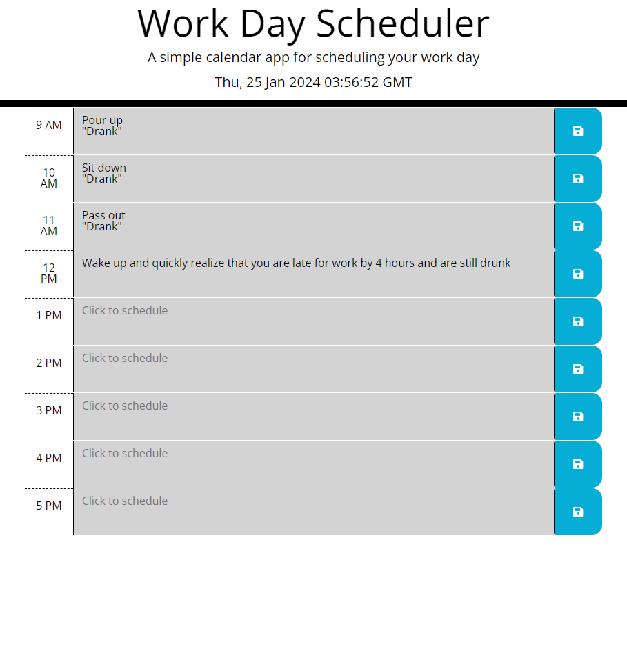

# Week-Five-challenge
# Day Planner

## Desription
A basic planner that can save events during each hour of the day, set to a typical work day of 9-5.
It will also tell you which events are still to happen and which have passed based on the color of the hour block.

## Usage
For each hour block, type in what you have scheduled for that time frame, and then click the save button on the right.
The current hour will be highlighted, and both past and future hours a color coded.

## License
Refer to license attached to the project